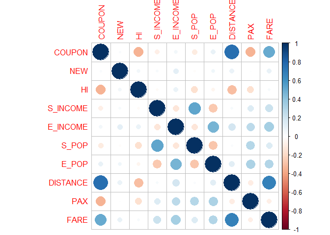
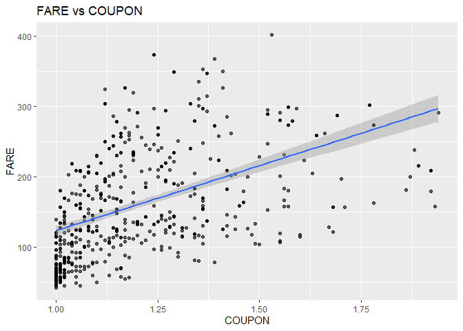
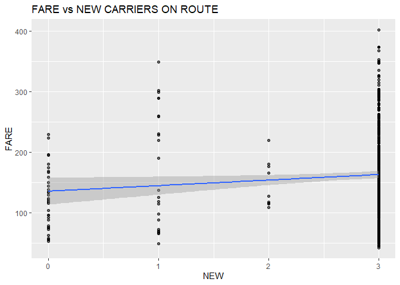
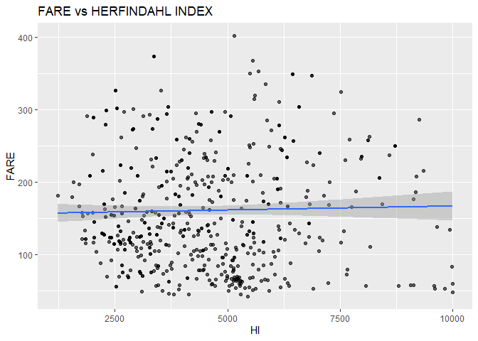
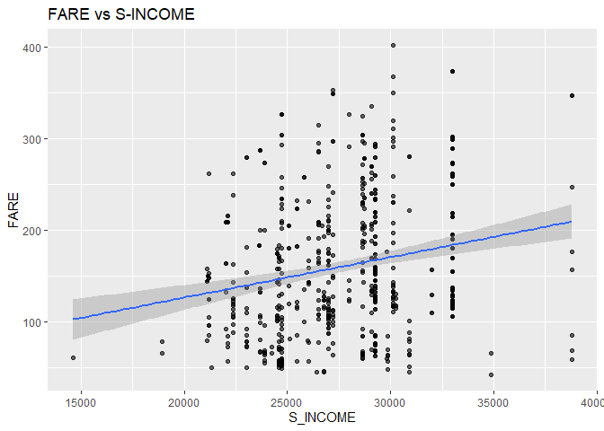
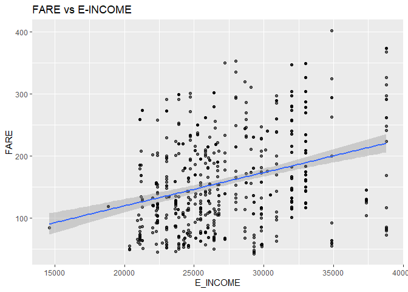
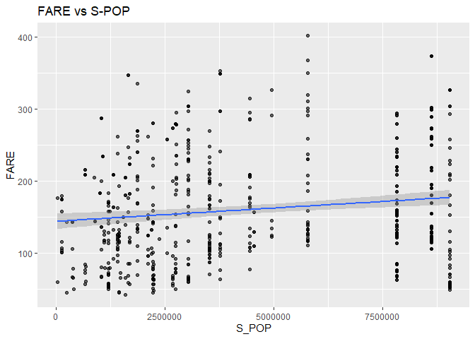
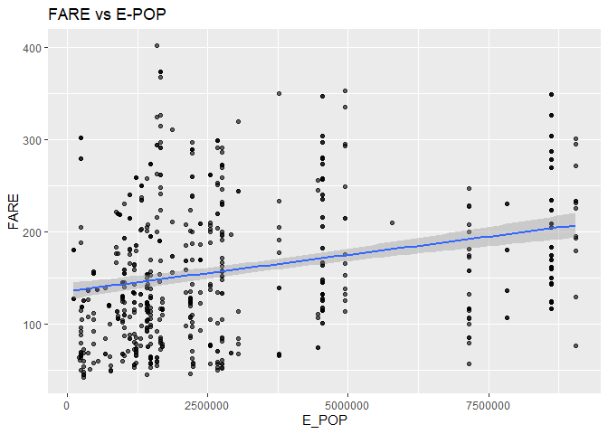
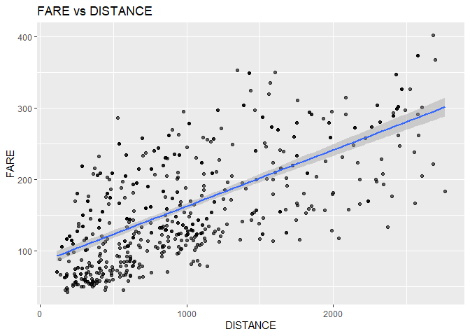
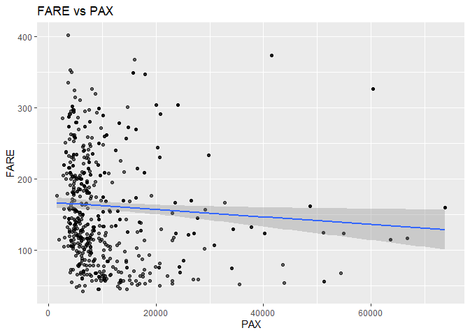

```r
airfares <- read.csv("Airfares.csv", header = TRUE)
airfares.dt <- setDT(airfares)
airlines <- airfares.dt[,!c(1,2,3,4,7,8,14,15)] 
airlines2 <- airfares.dt[,!c(1,2,3,4)]
airlines2.df <- setDF(airlines2)
```
#Answer 1

```r
library(corrplot)
```

```
## Warning: package 'corrplot' was built under R version 3.6.2
```

```
## corrplot 0.84 loaded
```

```r
cor.mat <- round(cor(airlines[,]),2)
cor.mat
```

```
##          COUPON   NEW    HI S_INCOME E_INCOME S_POP E_POP DISTANCE   PAX  FARE
## COUPON     1.00  0.02 -0.35    -0.09     0.05 -0.11  0.09     0.75 -0.34  0.50
## NEW        0.02  1.00  0.05     0.03     0.11 -0.02  0.06     0.08  0.01  0.09
## HI        -0.35  0.05  1.00    -0.03     0.08 -0.17 -0.06    -0.31 -0.17  0.03
## S_INCOME  -0.09  0.03 -0.03     1.00    -0.14  0.52 -0.27     0.03  0.14  0.21
## E_INCOME   0.05  0.11  0.08    -0.14     1.00 -0.14  0.46     0.18  0.26  0.33
## S_POP     -0.11 -0.02 -0.17     0.52    -0.14  1.00 -0.28     0.02  0.28  0.15
## E_POP      0.09  0.06 -0.06    -0.27     0.46 -0.28  1.00     0.12  0.31  0.29
## DISTANCE   0.75  0.08 -0.31     0.03     0.18  0.02  0.12     1.00 -0.10  0.67
## PAX       -0.34  0.01 -0.17     0.14     0.26  0.28  0.31    -0.10  1.00 -0.09
## FARE       0.50  0.09  0.03     0.21     0.33  0.15  0.29     0.67 -0.09  1.00
```

```r
corrplot(cor.mat,)
```

<!-- -->


```r
ggplot(airlines, aes(y = FARE, x = COUPON)) + 
  geom_point(alpha = 0.6) +
  geom_smooth(method="lm", se=TRUE, fullrange=FALSE, level=0.95) +
  ggtitle("FARE vs COUPON")
```

```
## `geom_smooth()` using formula 'y ~ x'
```

<!-- -->

```r
ggplot(airlines, aes(y = FARE, x = NEW))+
  geom_point(alpha = 0.6)+
  geom_smooth(method="lm", se=TRUE, fullrange=FALSE, level=0.95)+
  ggtitle("FARE vs NEW CARRIERS ON ROUTE")
```

```
## `geom_smooth()` using formula 'y ~ x'
```

<!-- -->

```r
ggplot(airlines, aes(y = FARE, x = HI))+
  geom_point(alpha = 0.6)+
  geom_smooth(method="lm", se=TRUE, fullrange=FALSE, level=0.95)+
  ggtitle("FARE vs HERFINDAHL INDEX")
```

```
## `geom_smooth()` using formula 'y ~ x'
```

<!-- -->

```r
ggplot(airlines, aes(y = FARE, x = S_INCOME))+
  geom_point(alpha = 0.6)+
  geom_smooth(method="lm", se=TRUE, fullrange=FALSE, level=0.95)+
  ggtitle("FARE vs S-INCOME")
```

```
## `geom_smooth()` using formula 'y ~ x'
```

<!-- -->

```r
ggplot(airlines, aes(y = FARE, x = E_INCOME))+
  geom_point(alpha = 0.6)+
  geom_smooth(method="lm", se=TRUE, fullrange=FALSE, level=0.95)+
  ggtitle("FARE vs E-INCOME")
```

```
## `geom_smooth()` using formula 'y ~ x'
```

<!-- -->

```r
ggplot(airlines, aes(y = FARE, x = S_POP))+
  geom_point(alpha = 0.6)+
  geom_smooth(method="lm", se=TRUE, fullrange=FALSE, level=0.95)+
  ggtitle("FARE vs S-POP")
```

```
## `geom_smooth()` using formula 'y ~ x'
```

<!-- -->

```r
ggplot(airlines, aes(y = FARE, x = E_POP))+
  geom_point(alpha = 0.6)+
  geom_smooth(method="lm", se=TRUE, fullrange=FALSE, level=0.95)+
  ggtitle("FARE vs E-POP")
```

```
## `geom_smooth()` using formula 'y ~ x'
```

<!-- -->

```r
ggplot(airlines, aes(y = FARE, x = DISTANCE))+
  geom_point(alpha = 0.6)+
  geom_smooth(method="lm", se=TRUE, fullrange=FALSE, level=0.95)+
  ggtitle("FARE vs DISTANCE")
```

```
## `geom_smooth()` using formula 'y ~ x'
```

<!-- -->

```r
ggplot(airlines, aes(y = FARE, x = PAX))+
  geom_point(alpha = 0.6)+
  geom_smooth(method="lm", se=TRUE, fullrange=FALSE, level=0.95)+
  ggtitle("FARE vs PAX")
```

```
## `geom_smooth()` using formula 'y ~ x'
```

<!-- -->
**From the Correlation matrix and the scatter plots we can see that distance is highly correlated and followed by coupon.This both are highly positively correlated with each other.Single best predictor of Fare is Distance because it has highest correlation coefficent 0.67**

#Answer 2

```r
library(dplyr)
library(rvest)
library(magrittr)
```

```
## 
## Attaching package: 'magrittr'
```

```
## The following object is masked from 'package:purrr':
## 
##     set_names
```

```
## The following object is masked from 'package:tidyr':
## 
##     extract
```

```r
PivotVacation <- airfares.dt %>%
        dplyr::select(VACATION,FARE) %>%
        group_by(VACATION) %>%
        summarise(Response_Count = length(VACATION),ResponseTotal = nrow(airfares.dt), ResponsePercent = percent(length(VACATION)/nrow(airfares.dt)), AvgFare = mean(FARE))

PivotSW <- airfares.dt %>%
        dplyr::select(SW,FARE) %>%
        group_by(SW) %>%
        summarise(Response_Count = length(SW),ResponseTotal = nrow(airfares.dt), ResponsePercent = percent(length(SW)/nrow(airfares.dt)), AvgFare = mean(FARE))

PivotGate <- airfares.dt %>%
        dplyr::select(GATE,FARE) %>%
        group_by(GATE) %>%
        summarise(Response_Count = length(GATE),ResponseTotal = nrow(airfares.dt), ResponsePercent = percent(length(GATE)/nrow(airfares.dt)), AvgFare = mean(FARE))

PivotSlot <- airfares.dt %>%
        dplyr::select(SLOT,FARE) %>%
        group_by(SLOT) %>%
        summarise(Response_Count = length(SLOT),ResponseTotal = nrow(airfares.dt), ResponsePercent = percent(length(SLOT)/nrow(airfares.dt)), AvgFare = mean(FARE))

PivotVacation
```

```
## # A tibble: 2 x 5
##   VACATION Response_Count ResponseTotal ResponsePercent AvgFare
##   <fct>             <int>         <int> <chr>             <dbl>
## 1 No                  468           638 73%                174.
## 2 Yes                 170           638 27%                126.
```

```r
PivotSW
```

```
## # A tibble: 2 x 5
##   SW    Response_Count ResponseTotal ResponsePercent AvgFare
##   <fct>          <int>         <int> <chr>             <dbl>
## 1 No               444           638 70%               188. 
## 2 Yes              194           638 30%                98.4
```

```r
PivotGate
```

```
## # A tibble: 2 x 5
##   GATE        Response_Count ResponseTotal ResponsePercent AvgFare
##   <fct>                <int>         <int> <chr>             <dbl>
## 1 Constrained            124           638 19%                193.
## 2 Free                   514           638 81%                153.
```

```r
PivotSlot
```

```
## # A tibble: 2 x 5
##   SLOT       Response_Count ResponseTotal ResponsePercent AvgFare
##   <fct>               <int>         <int> <chr>             <dbl>
## 1 Controlled            182           638 29%                186.
## 2 Free                  456           638 71%                151.
```
**Categorical predictor which seems best for predicting Fare is SW as wherever SW airlines is serving fares are much lower than the route where sw is not serving, so we can decide if sw is serving on that route then fare will be low else it will be high.**

#Answer 3

```r
set.seed(42)
train.index <- sample(1:638, round(0.8*nrow(airlines2)))
airfare.train.df <- airlines2[train.index, ]

airfare.test.df <- airlines2[-train.index, ]
```


```r
airfares.lm <- lm(FARE ~ ., data = airfare.train.df)
options(scipen = 999)
summary(airfares.lm)
```

```
## 
## Call:
## lm(formula = FARE ~ ., data = airfare.train.df)
## 
## Residuals:
##     Min      1Q  Median      3Q     Max 
## -99.282 -23.384  -2.476  22.156 106.501 
## 
## Coefficients:
##                   Estimate     Std. Error t value             Pr(>|t|)    
## (Intercept)  13.8781441835  30.7076946550   0.452             0.651507    
## COUPON       11.6744988371  13.6949175687   0.852             0.394365    
## NEW          -2.2468005921   2.0827213457  -1.079             0.281210    
## VACATIONYes -37.8385127965   3.9788129464  -9.510 < 0.0000000000000002 ***
## SWYes       -38.9566477546   4.2526101838  -9.161 < 0.0000000000000002 ***
## HI            0.0085414832   0.0010936608   7.810   0.0000000000000343 ***
## S_INCOME      0.0006160967   0.0005709965   1.079             0.281119    
## E_INCOME      0.0015472928   0.0004141497   3.736             0.000209 ***
## S_POP         0.0000040087   0.0000007411   5.409   0.0000000987167149 ***
## E_POP         0.0000039572   0.0000008329   4.751   0.0000026562530825 ***
## SLOTFree    -16.4322948237   4.3647846605  -3.765             0.000187 ***
## GATEFree    -21.1634823059   4.4093579183  -4.800   0.0000021065804690 ***
## DISTANCE      0.0715673994   0.0039223121  18.246 < 0.0000000000000002 ***
## PAX          -0.0007340587   0.0001662490  -4.415   0.0000123830100844 ***
## ---
## Signif. codes:  0 '***' 0.001 '**' 0.01 '*' 0.05 '.' 0.1 ' ' 1
## 
## Residual standard error: 35.41 on 496 degrees of freedom
## Multiple R-squared:  0.7817,	Adjusted R-squared:  0.7759 
## F-statistic: 136.6 on 13 and 496 DF,  p-value: < 0.00000000000000022
```
#Answer 4

```r
Stepwise <- regsubsets(FARE ~ ., data = airfare.train.df, nbest = 1, nvmax = dim(airfare.train.df)[2],
                     method = "seqrep")
Stepwise.Summary <- summary(Stepwise)
Stepwise.Summary
```

```
## Subset selection object
## Call: regsubsets.formula(FARE ~ ., data = airfare.train.df, nbest = 1, 
##     nvmax = dim(airfare.train.df)[2], method = "seqrep")
## 13 Variables  (and intercept)
##             Forced in Forced out
## COUPON          FALSE      FALSE
## NEW             FALSE      FALSE
## VACATIONYes     FALSE      FALSE
## SWYes           FALSE      FALSE
## HI              FALSE      FALSE
## S_INCOME        FALSE      FALSE
## E_INCOME        FALSE      FALSE
## S_POP           FALSE      FALSE
## E_POP           FALSE      FALSE
## SLOTFree        FALSE      FALSE
## GATEFree        FALSE      FALSE
## DISTANCE        FALSE      FALSE
## PAX             FALSE      FALSE
## 1 subsets of each size up to 13
## Selection Algorithm: 'sequential replacement'
##           COUPON NEW VACATIONYes SWYes HI  S_INCOME E_INCOME S_POP E_POP
## 1  ( 1 )  " "    " " " "         " "   " " " "      " "      " "   " "  
## 2  ( 1 )  " "    " " " "         "*"   " " " "      " "      " "   " "  
## 3  ( 1 )  " "    " " "*"         "*"   " " " "      " "      " "   " "  
## 4  ( 1 )  " "    " " "*"         "*"   "*" " "      " "      " "   " "  
## 5  ( 1 )  " "    " " "*"         "*"   "*" " "      " "      " "   " "  
## 6  ( 1 )  " "    " " "*"         "*"   "*" " "      " "      " "   " "  
## 7  ( 1 )  " "    " " "*"         "*"   "*" " "      "*"      " "   " "  
## 8  ( 1 )  " "    " " "*"         "*"   "*" " "      "*"      "*"   "*"  
## 9  ( 1 )  " "    " " "*"         "*"   "*" " "      " "      "*"   "*"  
## 10  ( 1 ) "*"    "*" "*"         "*"   "*" "*"      "*"      "*"   "*"  
## 11  ( 1 ) " "    "*" "*"         "*"   "*" " "      "*"      "*"   "*"  
## 12  ( 1 ) " "    "*" "*"         "*"   "*" "*"      "*"      "*"   "*"  
## 13  ( 1 ) "*"    "*" "*"         "*"   "*" "*"      "*"      "*"   "*"  
##           SLOTFree GATEFree DISTANCE PAX
## 1  ( 1 )  " "      " "      "*"      " "
## 2  ( 1 )  " "      " "      "*"      " "
## 3  ( 1 )  " "      " "      "*"      " "
## 4  ( 1 )  " "      " "      "*"      " "
## 5  ( 1 )  "*"      " "      "*"      " "
## 6  ( 1 )  "*"      "*"      "*"      " "
## 7  ( 1 )  "*"      "*"      "*"      " "
## 8  ( 1 )  " "      " "      "*"      "*"
## 9  ( 1 )  "*"      "*"      "*"      "*"
## 10  ( 1 ) "*"      " "      " "      " "
## 11  ( 1 ) "*"      "*"      "*"      "*"
## 12  ( 1 ) "*"      "*"      "*"      "*"
## 13  ( 1 ) "*"      "*"      "*"      "*"
```

```r
Stepwise.Summary$which
```

```
##    (Intercept) COUPON   NEW VACATIONYes SWYes    HI S_INCOME E_INCOME S_POP
## 1         TRUE  FALSE FALSE       FALSE FALSE FALSE    FALSE    FALSE FALSE
## 2         TRUE  FALSE FALSE       FALSE  TRUE FALSE    FALSE    FALSE FALSE
## 3         TRUE  FALSE FALSE        TRUE  TRUE FALSE    FALSE    FALSE FALSE
## 4         TRUE  FALSE FALSE        TRUE  TRUE  TRUE    FALSE    FALSE FALSE
## 5         TRUE  FALSE FALSE        TRUE  TRUE  TRUE    FALSE    FALSE FALSE
## 6         TRUE  FALSE FALSE        TRUE  TRUE  TRUE    FALSE    FALSE FALSE
## 7         TRUE  FALSE FALSE        TRUE  TRUE  TRUE    FALSE     TRUE FALSE
## 8         TRUE  FALSE FALSE        TRUE  TRUE  TRUE    FALSE     TRUE  TRUE
## 9         TRUE  FALSE FALSE        TRUE  TRUE  TRUE    FALSE    FALSE  TRUE
## 10        TRUE   TRUE  TRUE        TRUE  TRUE  TRUE     TRUE     TRUE  TRUE
## 11        TRUE  FALSE  TRUE        TRUE  TRUE  TRUE    FALSE     TRUE  TRUE
## 12        TRUE  FALSE  TRUE        TRUE  TRUE  TRUE     TRUE     TRUE  TRUE
## 13        TRUE   TRUE  TRUE        TRUE  TRUE  TRUE     TRUE     TRUE  TRUE
##    E_POP SLOTFree GATEFree DISTANCE   PAX
## 1  FALSE    FALSE    FALSE     TRUE FALSE
## 2  FALSE    FALSE    FALSE     TRUE FALSE
## 3  FALSE    FALSE    FALSE     TRUE FALSE
## 4  FALSE    FALSE    FALSE     TRUE FALSE
## 5  FALSE     TRUE    FALSE     TRUE FALSE
## 6  FALSE     TRUE     TRUE     TRUE FALSE
## 7  FALSE     TRUE     TRUE     TRUE FALSE
## 8   TRUE    FALSE    FALSE     TRUE  TRUE
## 9   TRUE     TRUE     TRUE     TRUE  TRUE
## 10  TRUE     TRUE    FALSE    FALSE FALSE
## 11  TRUE     TRUE     TRUE     TRUE  TRUE
## 12  TRUE     TRUE     TRUE     TRUE  TRUE
## 13  TRUE     TRUE     TRUE     TRUE  TRUE
```

```r
print("Adjusted R-Squared") 
```

```
## [1] "Adjusted R-Squared"
```

```r
as.matrix(Stepwise.Summary$adjr2)
```

```
##            [,1]
##  [1,] 0.4156589
##  [2,] 0.5777302
##  [3,] 0.6948231
##  [4,] 0.7210558
##  [5,] 0.7340429
##  [6,] 0.7536799
##  [7,] 0.7570792
##  [8,] 0.7637820
##  [9,] 0.7707638
## [10,] 0.6229086
## [11,] 0.7760679
## [12,] 0.7760708
## [13,] 0.7759476
```

```r
print("BIC")  
```

```
## [1] "BIC"
```

```r
as.matrix(Stepwise.Summary$bic)
```

```
##            [,1]
##  [1,] -262.5420
##  [2,] -422.9811
##  [3,] -583.3777
##  [4,] -623.9909
##  [5,] -643.0825
##  [6,] -676.9795
##  [7,] -678.8472
##  [8,] -687.8998
##  [9,] -697.9854
## [10,] -438.9274
## [11,] -699.4997
## [12,] -694.2972
## [13,] -688.8094
```

```r
print("CP")  
```

```
## [1] "CP"
```

```r
as.matrix(Stepwise.Summary$cp)
```

```
##            [,1]
##  [1,] 818.89220
##  [2,] 451.53899
##  [3,] 187.21153
##  [4,] 128.72255
##  [5,] 100.26346
##  [6,]  56.99127
##  [7,]  50.27558
##  [8,]  36.20326
##  [9,]  21.56831
## [10,] 351.84190
## [11,]  11.73270
## [12,]  12.72670
## [13,]  14.00000
```
**Answer 4: We can see in the stepwise regression that initial data had 13 variables to start with. After running this regression against Fare, the variables have been dropped to 10.The dropped variables are Coupons and S_Income.We have arrived to this conclusion based on the adjusted Rsquare values and cp and bic and R square values obtained.As adjusted R square has to be highest '0.7760679', the safest place where it is highest '0.7760679' and CP is should be 12  and '11.73270 closest value is found at 11th place.As we can seein 11th pattern, Coupons and S_Income is False, hence it suffices to say that these variables dropped would make the model work better.**

#Answer 5

```r
Exhaustive <- regsubsets(FARE ~ ., data = airfare.train.df, nbest = 1, nvmax = dim(airfare.train.df)[2],
                     method = "exhaustive")
Exhaustive.Summary <- summary(Exhaustive)
Exhaustive.Summary$which
```

```
##    (Intercept) COUPON   NEW VACATIONYes SWYes    HI S_INCOME E_INCOME S_POP
## 1         TRUE  FALSE FALSE       FALSE FALSE FALSE    FALSE    FALSE FALSE
## 2         TRUE  FALSE FALSE       FALSE  TRUE FALSE    FALSE    FALSE FALSE
## 3         TRUE  FALSE FALSE        TRUE  TRUE FALSE    FALSE    FALSE FALSE
## 4         TRUE  FALSE FALSE        TRUE  TRUE  TRUE    FALSE    FALSE FALSE
## 5         TRUE  FALSE FALSE        TRUE  TRUE  TRUE    FALSE    FALSE FALSE
## 6         TRUE  FALSE FALSE        TRUE  TRUE  TRUE    FALSE    FALSE FALSE
## 7         TRUE  FALSE FALSE        TRUE  TRUE  TRUE    FALSE    FALSE  TRUE
## 8         TRUE  FALSE FALSE        TRUE  TRUE  TRUE    FALSE     TRUE  TRUE
## 9         TRUE  FALSE FALSE        TRUE  TRUE  TRUE    FALSE    FALSE  TRUE
## 10        TRUE  FALSE FALSE        TRUE  TRUE  TRUE    FALSE     TRUE  TRUE
## 11        TRUE  FALSE  TRUE        TRUE  TRUE  TRUE    FALSE     TRUE  TRUE
## 12        TRUE  FALSE  TRUE        TRUE  TRUE  TRUE     TRUE     TRUE  TRUE
## 13        TRUE   TRUE  TRUE        TRUE  TRUE  TRUE     TRUE     TRUE  TRUE
##    E_POP SLOTFree GATEFree DISTANCE   PAX
## 1  FALSE    FALSE    FALSE     TRUE FALSE
## 2  FALSE    FALSE    FALSE     TRUE FALSE
## 3  FALSE    FALSE    FALSE     TRUE FALSE
## 4  FALSE    FALSE    FALSE     TRUE FALSE
## 5  FALSE     TRUE    FALSE     TRUE FALSE
## 6  FALSE     TRUE     TRUE     TRUE FALSE
## 7   TRUE    FALSE    FALSE     TRUE  TRUE
## 8   TRUE    FALSE    FALSE     TRUE  TRUE
## 9   TRUE     TRUE     TRUE     TRUE  TRUE
## 10  TRUE     TRUE     TRUE     TRUE  TRUE
## 11  TRUE     TRUE     TRUE     TRUE  TRUE
## 12  TRUE     TRUE     TRUE     TRUE  TRUE
## 13  TRUE     TRUE     TRUE     TRUE  TRUE
```

```r
print("Adjusted R-Squared") 
```

```
## [1] "Adjusted R-Squared"
```

```r
as.matrix(Exhaustive.Summary$adjr2)
```

```
##            [,1]
##  [1,] 0.4156589
##  [2,] 0.5777302
##  [3,] 0.6948231
##  [4,] 0.7210558
##  [5,] 0.7340429
##  [6,] 0.7536799
##  [7,] 0.7574419
##  [8,] 0.7637820
##  [9,] 0.7707638
## [10,] 0.7759090
## [11,] 0.7760679
## [12,] 0.7760708
## [13,] 0.7759476
```

```r
print("BIC")  
```

```
## [1] "BIC"
```

```r
as.matrix(Exhaustive.Summary$bic)
```

```
##            [,1]
##  [1,] -262.5420
##  [2,] -422.9811
##  [3,] -583.3777
##  [4,] -623.9909
##  [5,] -643.0825
##  [6,] -676.9795
##  [7,] -679.6093
##  [8,] -687.8998
##  [9,] -697.9854
## [10,] -704.3493
## [11,] -699.4997
## [12,] -694.2972
## [13,] -688.8094
```

```r
print("CP")  
```

```
## [1] "CP"
```

```r
as.matrix(Exhaustive.Summary$cp)
```

```
##            [,1]
##  [1,] 818.89220
##  [2,] 451.53899
##  [3,] 187.21153
##  [4,] 128.72255
##  [5,] 100.26346
##  [6,]  56.99127
##  [7,]  49.46286
##  [8,]  36.20326
##  [9,]  21.56831
## [10,]  11.08605
## [11,]  11.73270
## [12,]  12.72670
## [13,]  14.00000
```
**Answer 5: The results of the stepwise and exhaustive are almost similar.With exhaustive we can see that the model with 10 variables is the best model.The variables include are VACATION, SW, HI, E_INCOME, S_POP, E_POP, SLOT, GATE, DISTANCE, PAX.The cp value is also almost closest to 11 and Adjusted R2 is also highest.The dropped variables are NEW,Coupon,S_Income**

#Answer 6

```r
print("Accuracy of Stepwise Regression")
```

```
## [1] "Accuracy of Stepwise Regression"
```

```r
stepwise.lm <- lm(formula = FARE ~ NEW + VACATION + SW + HI + E_INCOME + S_POP + E_POP + SLOT + GATE + DISTANCE + PAX, data = airfare.train.df)
stepwise.lm.predict <- predict(stepwise.lm, airfare.test.df)
accuracy(stepwise.lm.predict, airfare.test.df$FARE)
```

```
##                ME     RMSE      MAE       MPE     MAPE
## Test set 3.166677 36.82363 27.57897 -5.812025 21.44043
```

```r
print("Accuracy of Exhaustive Regression")
```

```
## [1] "Accuracy of Exhaustive Regression"
```

```r
exhaustive.lm <- lm(formula = FARE ~ VACATION + SW + HI + E_INCOME + S_POP + E_POP + SLOT + GATE + DISTANCE + PAX, data = airfare.train.df)
exhaustive.lm.predict <- predict(exhaustive.lm, airfare.test.df)
accuracy(exhaustive.lm.predict, airfare.test.df$FARE)
```

```
##               ME    RMSE      MAE       MPE     MAPE
## Test set 3.06081 36.8617 27.70568 -5.938062 21.62142
```

**Answer 6: The RMSE value for stepwise Regression is less compared to the exhaustive search model. So we can say that the stepwise regression model is best compared exhaustive search**

#Answer 7 & 8

```r
Exhaustive_pred_value_SW0 <- stepwise.lm$coefficients["VACATIONYes"]*0+
                             stepwise.lm$coefficients["SWYes"]*0+
                             stepwise.lm$coefficients["HI"]*4442.141 +
                             stepwise.lm$coefficients["E_INCOME"]*27664 +
                             stepwise.lm$coefficients["S_POP"]*4557004 +
                             stepwise.lm$coefficients["E_POP"]*3195503 +
                             stepwise.lm$coefficients["DISTANCE"]*1976 +
                             stepwise.lm$coefficients["PAX"]*12782 +
                             stepwise.lm$coefficients["(Intercept)"]
print("Exhaustive_pred_value_SW0")
```

```
## [1] "Exhaustive_pred_value_SW0"
```

```r
print(Exhaustive_pred_value_SW0)
```

```
## VACATIONYes 
##    293.1706
```

```r
Exhaustive_pred_value_SW1 <- stepwise.lm$coefficients["VACATIONYes"]*0+
                             stepwise.lm$coefficients["SWYes"]*1+
                             stepwise.lm$coefficients["HI"]*4442.141 +
                             stepwise.lm$coefficients["E_INCOME"]*27664 +
                             stepwise.lm$coefficients["S_POP"]*4557004 +
                             stepwise.lm$coefficients["E_POP"]*3195503 +
                             stepwise.lm$coefficients["DISTANCE"]*1976 +
                             stepwise.lm$coefficients["PAX"]*12782 +
                             stepwise.lm$coefficients["(Intercept)"]
print("Exhaustive_pred_value_SW1")
```

```
## [1] "Exhaustive_pred_value_SW1"
```

```r
print(Exhaustive_pred_value_SW1)
```

```
## VACATIONYes 
##     252.599
```

```r
avg_reduction_fare <- Exhaustive_pred_value_SW0-Exhaustive_pred_value_SW1
print("AVERAGE REDUCTION FARE")
```

```
## [1] "AVERAGE REDUCTION FARE"
```

```r
print(avg_reduction_fare)
```

```
## VACATIONYes 
##    40.57159
```
** Answer 7 & 8 :we see that there is a reduction in Fare of $40.57  when Southwest airline is not serving versus when it is serving the route.**

#Answer 9 :

```r
lm.backward_S_airfares<- regsubsets(FARE~., data=airfare.train.df, nbest= 1,nvmax=dim(airfare.train.df)[2], method="backward")
summary_Q9<- summary(lm.backward_S_airfares)
summary_Q9$which
```

```
##    (Intercept) COUPON   NEW VACATIONYes SWYes    HI S_INCOME E_INCOME S_POP
## 1         TRUE  FALSE FALSE       FALSE FALSE FALSE    FALSE    FALSE FALSE
## 2         TRUE  FALSE FALSE       FALSE  TRUE FALSE    FALSE    FALSE FALSE
## 3         TRUE  FALSE FALSE        TRUE  TRUE FALSE    FALSE    FALSE FALSE
## 4         TRUE  FALSE FALSE        TRUE  TRUE  TRUE    FALSE    FALSE FALSE
## 5         TRUE  FALSE FALSE        TRUE  TRUE  TRUE    FALSE    FALSE FALSE
## 6         TRUE  FALSE FALSE        TRUE  TRUE  TRUE    FALSE    FALSE  TRUE
## 7         TRUE  FALSE FALSE        TRUE  TRUE  TRUE    FALSE    FALSE  TRUE
## 8         TRUE  FALSE FALSE        TRUE  TRUE  TRUE    FALSE    FALSE  TRUE
## 9         TRUE  FALSE FALSE        TRUE  TRUE  TRUE    FALSE    FALSE  TRUE
## 10        TRUE  FALSE FALSE        TRUE  TRUE  TRUE    FALSE     TRUE  TRUE
## 11        TRUE  FALSE  TRUE        TRUE  TRUE  TRUE    FALSE     TRUE  TRUE
## 12        TRUE  FALSE  TRUE        TRUE  TRUE  TRUE     TRUE     TRUE  TRUE
## 13        TRUE   TRUE  TRUE        TRUE  TRUE  TRUE     TRUE     TRUE  TRUE
##    E_POP SLOTFree GATEFree DISTANCE   PAX
## 1  FALSE    FALSE    FALSE     TRUE FALSE
## 2  FALSE    FALSE    FALSE     TRUE FALSE
## 3  FALSE    FALSE    FALSE     TRUE FALSE
## 4  FALSE    FALSE    FALSE     TRUE FALSE
## 5   TRUE    FALSE    FALSE     TRUE FALSE
## 6   TRUE    FALSE    FALSE     TRUE FALSE
## 7   TRUE    FALSE    FALSE     TRUE  TRUE
## 8   TRUE    FALSE     TRUE     TRUE  TRUE
## 9   TRUE     TRUE     TRUE     TRUE  TRUE
## 10  TRUE     TRUE     TRUE     TRUE  TRUE
## 11  TRUE     TRUE     TRUE     TRUE  TRUE
## 12  TRUE     TRUE     TRUE     TRUE  TRUE
## 13  TRUE     TRUE     TRUE     TRUE  TRUE
```

```r
summary_Q9$cp
```

```
##  [1] 818.89220 451.53899 187.21153 128.72255 110.32120  69.68802  49.46286
##  [8]  38.75199  21.56831  11.08605  11.73270  12.72670  14.00000
```

```r
summary_Q9$adjr2
```

```
##  [1] 0.4156589 0.5777302 0.6948231 0.7210558 0.7295718 0.7480243 0.7574419
##  [8] 0.7626422 0.7707638 0.7759090 0.7760679 0.7760708 0.7759476
```

**Answer 9 :We have dropped 3 variables from the model namely: COUPON, S_INCOME & NEW based on the ajusted R2 and Cp values. The model dropped similar variables as the exhaustive search.**

#Answer 10

```r
lm.backward_S_AIC_airfares <-lm(FARE ~., data = airfare.train.df)
lm.backward_S_AIC_airfares_Predict <- stepAIC(lm.backward_S_AIC_airfares, direction = "backward")
```

```
## Start:  AIC=3652.06
## FARE ~ COUPON + NEW + VACATION + SW + HI + S_INCOME + E_INCOME + 
##     S_POP + E_POP + SLOT + GATE + DISTANCE + PAX
## 
##            Df Sum of Sq     RSS    AIC
## - COUPON    1       911  622732 3650.8
## - NEW       1      1459  623280 3651.3
## - S_INCOME  1      1460  623281 3651.3
## <none>                   621821 3652.1
## - E_INCOME  1     17499  639320 3664.2
## - SLOT      1     17769  639590 3664.4
## - PAX       1     24441  646263 3669.7
## - E_POP     1     28296  650118 3672.8
## - GATE      1     28881  650702 3673.2
## - S_POP     1     36680  658501 3679.3
## - HI        1     76469  698290 3709.2
## - SW        1    105205  727026 3729.8
## - VACATION  1    113382  735204 3735.5
## - DISTANCE  1    417379 1039200 3912.0
## 
## Step:  AIC=3650.81
## FARE ~ NEW + VACATION + SW + HI + S_INCOME + E_INCOME + S_POP + 
##     E_POP + SLOT + GATE + DISTANCE + PAX
## 
##            Df Sum of Sq     RSS    AIC
## - S_INCOME  1      1261  623994 3649.8
## - NEW       1      1678  624410 3650.2
## <none>                   622732 3650.8
## - E_INCOME  1     17126  639859 3662.6
## - SLOT      1     18407  641139 3663.7
## - GATE      1     29285  652018 3672.2
## - E_POP     1     29484  652217 3672.4
## - PAX       1     34128  656860 3676.0
## - S_POP     1     36089  658821 3677.5
## - HI        1     78594  701326 3709.4
## - SW        1    107735  730468 3730.2
## - VACATION  1    114276  737009 3734.7
## - DISTANCE  1    824468 1447200 4078.9
## 
## Step:  AIC=3649.84
## FARE ~ NEW + VACATION + SW + HI + E_INCOME + S_POP + E_POP + 
##     SLOT + GATE + DISTANCE + PAX
## 
##            Df Sum of Sq     RSS    AIC
## - NEW       1      1697  625690 3649.2
## <none>                   623994 3649.8
## - E_INCOME  1     16167  640161 3660.9
## - SLOT      1     20012  644006 3663.9
## - E_POP     1     28559  652552 3670.7
## - GATE      1     29766  653759 3671.6
## - PAX       1     32869  656863 3674.0
## - S_POP     1     41722  665715 3680.8
## - HI        1     79501  703495 3709.0
## - SW        1    126837  750831 3742.2
## - VACATION  1    128080  752073 3743.1
## - DISTANCE  1    826967 1450960 4078.2
## 
## Step:  AIC=3649.22
## FARE ~ VACATION + SW + HI + E_INCOME + S_POP + E_POP + SLOT + 
##     GATE + DISTANCE + PAX
## 
##            Df Sum of Sq     RSS    AIC
## <none>                   625690 3649.2
## - E_INCOME  1     15649  641339 3659.8
## - SLOT      1     19217  644907 3662.6
## - E_POP     1     28766  654456 3670.1
## - GATE      1     29165  654856 3670.5
## - PAX       1     32706  658396 3673.2
## - S_POP     1     42648  668338 3680.9
## - HI        1     78891  704581 3707.8
## - SW        1    126577  752267 3741.2
## - VACATION  1    127066  752756 3741.5
## - DISTANCE  1    825966 1451656 4076.4
```

```r
summary_Q10<-summary(lm.backward_S_AIC_airfares_Predict)
summary_Q10
```

```
## 
## Call:
## lm(formula = FARE ~ VACATION + SW + HI + E_INCOME + S_POP + E_POP + 
##     SLOT + GATE + DISTANCE + PAX, data = airfare.train.df)
## 
## Residuals:
##     Min      1Q  Median      3Q     Max 
## -99.148 -22.077  -2.028  21.491 107.744 
## 
## Coefficients:
##                   Estimate     Std. Error t value             Pr(>|t|)    
## (Intercept)  42.0764345686  14.7566725244   2.851             0.004534 ** 
## VACATIONYes -38.7574569132   3.8500841929 -10.067 < 0.0000000000000002 ***
## SWYes       -40.5282166043   4.0337560764 -10.047 < 0.0000000000000002 ***
## HI            0.0082681499   0.0010423739   7.932   0.0000000000000143 ***
## E_INCOME      0.0014446281   0.0004089281   3.533             0.000450 ***
## S_POP         0.0000041850   0.0000007176   5.832   0.0000000098509604 ***
## E_POP         0.0000037791   0.0000007890   4.790   0.0000022053722984 ***
## SLOTFree    -16.8515659965   4.3045728245  -3.915             0.000103 ***
## GATEFree    -21.2165142735   4.3991611435  -4.823   0.0000018824635124 ***
## DISTANCE      0.0736714582   0.0028704349  25.666 < 0.0000000000000002 ***
## PAX          -0.0007619280   0.0001491869  -5.107   0.0000004660838631 ***
## ---
## Signif. codes:  0 '***' 0.001 '**' 0.01 '*' 0.05 '.' 0.1 ' ' 1
## 
## Residual standard error: 35.41 on 499 degrees of freedom
## Multiple R-squared:  0.7803,	Adjusted R-squared:  0.7759 
## F-statistic: 177.2 on 10 and 499 DF,  p-value: < 0.00000000000000022
```
**Answer 10: We say that when we didn’t drop any variable, our AIC was 3652.07. AIC kept on reducing as we kept dropping variables one by one. We are eliminating variables because to make a model better fit, we need to reduce AIC.  Let’s say when we dropped COUPON our AIC came to 3650.82 which is a minor drop. Now when we drop S_INCOME, Our AIC became 3649.84. Lastly when we dropped NEW; AIC was decreased to 3649.22. So, basically AIC from 3652.07 came drop to 3649.22 after removal of 3 variables. Also results in question 9 and 10 are same.**

